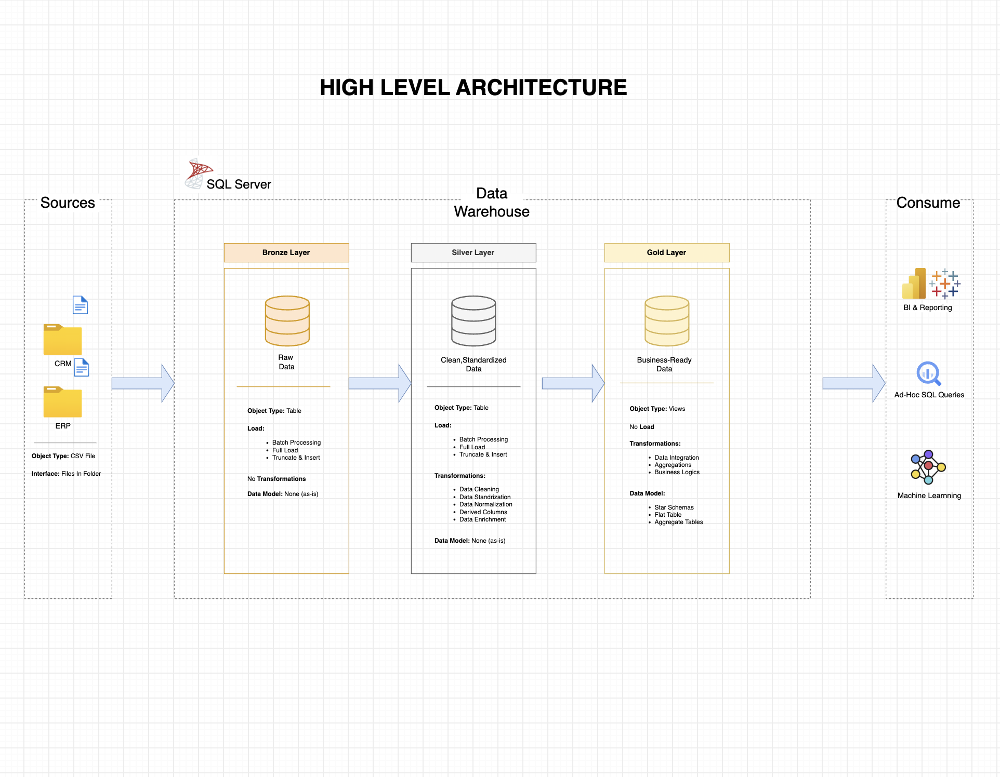

# High Level Architecture

This document describes the overall architecture of the SQL Data Warehouse project.

---

## Architecture Diagram

> **The architecture diagram will appear below once you upload the image.**

---

## Architecture Overview

The project follows the **Medallion Architecture** pattern consisting of three layers:

- **Bronze Layer** – Stores raw data from source systems.
- **Silver Layer** – Cleans, standardizes, and transforms the data.
- **Gold Layer** – Creates business-ready views for analytics and reporting.

### Data Flow

CRM / ERP
    │
    ▼
Bronze Layer
    │
    ▼
Silver Layer
    │
    ▼
Gold Layer
